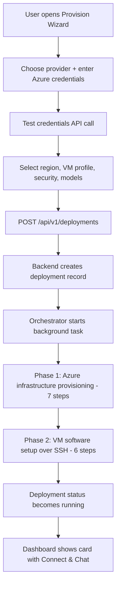
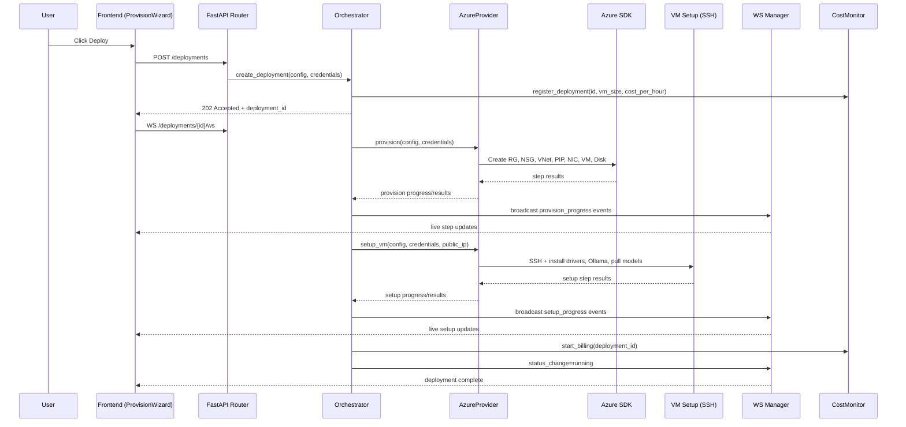

# PrivateAI Technical Explainer

This document explains how the application is structured and how provisioning runs from click to cloud resources. It is written for developers who are new to the codebase and need a fast, accurate mental model.

## What This App Does

PrivateAI provisions and manages Azure VMs for AI workloads through a full-stack interface:

- **Frontend:** Next.js 16 (React 19, Tailwind v4), optional Electron 41 shell
- **Backend:** FastAPI with REST + WebSocket APIs (6 routers, 5 services)
- **Cloud:** Azure SDK-based provisioning (no Azure CLI dependency)
- **VM setup:** SSH automation via Paramiko (drivers, Ollama, models)
- **Chat UI:** Open WebUI running locally as a managed subprocess
- **Cost control:** Background budget monitor with auto-shutdown

At a high level, the app does three jobs:

1. Create infrastructure in Azure (resource group, network, VM, disk)
2. Configure software on the VM (NVIDIA drivers, Ollama, model pulls)
3. Provide a local chat interface (Open WebUI) that talks to the remote Ollama server

---

## Current Architecture

```text
User (Browser/Electron)
        |
        v
Frontend (Next.js, app/*)
  - ProvisionWizard (4-step deploy flow)
  - Dashboard (deployment cards, cost bar, Connect & Chat)
  - Settings (credentials, budget, Open WebUI config)
  - Sidebar (navigation + Open WebUI status widget)
  - TerminalPanel / WebUIPanel (embedded SSH + chat)
        |
        | HTTP + WebSocket
        v
Backend (FastAPI, backend/app/*)
  - Routers (deployments/providers/services/terminal/cost/open-webui)
  - Orchestrator (async deployment lifecycle)
  - DeploymentStore (in-memory state)
  - CostMonitor (background budget enforcement)
  - OpenWebuiManager (subprocess lifecycle)
  - WSManager (live progress broadcasts)
  - Provider Registry (azure or mock)
        |
        +--------------------+-----------------------+
        |                    |                       |
        v                    v                       v
AzureProvider          VM Setup + Validation    Open WebUI subprocess
(Azure SDK)            (Paramiko SSH)           (isolated uv venv,
        |                                       CPU-only PyTorch)
        v                                            |
Azure Resources                              localhost:8080
(RG, NSG, VNet, PIP, NIC, VM, Disk)
```

---

## Repository Map

```text
backend/
  main.py                          # FastAPI app, 6 routers, startup/shutdown hooks
  requirements.txt                 # fastapi, azure-sdk, paramiko, httpx, pydantic
  app/
    routers/
      deployments.py               # CRUD, lifecycle, WS progress (11 endpoints)
      providers.py                 # Provider info, credential validation (3 endpoints)
      services.py                  # Service endpoint URLs (1 endpoint)
      terminal.py                  # SSH terminal WebSocket bridge (1 WS endpoint)
      cost.py                      # Budget, reports, alerts (6 endpoints)
      open_webui.py                # Open WebUI lifecycle + connect (8 endpoints)
    services/
      orchestrator.py              # Deployment lifecycle coordinator
      deployment_store.py          # Thread-safe in-memory record store
      ws_manager.py                # Per-deployment WebSocket fan-out
      cost_monitor.py              # Background cost tracker (30s tick)
      open_webui_manager.py        # Open WebUI subprocess manager
    providers/
      registry.py                  # Provider factory, PRIVATEAI_TEST_MODE switch
      base.py                      # Abstract CloudProvider (15 methods)
      azure/
        provider.py                # Full Azure SDK implementation (724 lines)
        config.py                  # VM profiles with pricing, regions, param builder
        vm_setup.py                # SSH: drivers, disk mount, Ollama, model pulls
        validator.py               # SSH: health checks (10 checks)
      mock/
        provider.py                # Mock provider for test mode
    models/
      deployment.py                # DeploymentConfig, DeploymentRecord, status enums
      credentials.py               # Azure/GCP/AWS credential discriminated union
      cost.py                      # BudgetConfig, CostReport, CostAlert, thresholds
      open_webui.py                # OpenWebuiEnvConfig, OpenWebuiState
      schemas.py                   # All API request/response Pydantic models

frontend/
  app/
    page.tsx                       # App shell: 4 pages (welcome, dashboard, provision, settings)
    layout.tsx                     # Root layout: dark theme, Geist fonts
    globals.css                    # Full design system: dark-first, animations, components
    dashboard/Dashboard.tsx        # Deployment cards, cost bar, Connect & Chat, terminal
    provision/ProvisionWizard.tsx   # 4-step wizard: provider, credentials, config, deploy
    settings/Settings.tsx          # 6 sections: creds, prefs, budget, Open WebUI, history, about
    components/
      Sidebar.tsx                  # Nav items + Open WebUI status widget
      WelcomeScreen.tsx            # First-run onboarding
      TerminalPanel.tsx            # xterm.js SSH terminal via WebSocket
      WebUIPanel.tsx               # iframe wrapper for Open WebUI
      cost/CostMonitor.tsx         # CostSummaryBar, CostDetailPanel, useCostMonitor hook
      icons/index.tsx              # SVG icon components
    lib/
      api.ts                       # 28 API client functions + WebSocket helper
      types.ts                     # TypeScript types mirroring all backend models
      storage.ts                   # localStorage: settings, deployment history
  electron/
    main.ts                        # Electron main process (BrowserWindow, dev/prod URL)
    preload.js                     # IPC bridge (whitelisted channels)
```

---

## End-to-End Provisioning Flow

### 1) User-driven flow



### 2) API and async execution flow



---

## Backend Execution Model

### Request lifecycle

1. `routers/deployments.py` receives `POST /api/v1/deployments`
2. `DeploymentOrchestrator.create_deployment()` persists initial record and registers with CostMonitor
3. Orchestrator launches `_run_provision()` via `asyncio.create_task(...)`
4. Client receives immediate `202 Accepted` (non-blocking UX)
5. Frontend subscribes to WebSocket updates

### State and progress signaling

- **Deployment state:** `DeploymentStore` (in-memory, thread-safe)
- **Progress fan-out:** `WSManager.broadcast(deployment_id, {...})`
- **Cost tracking:** `CostMonitor` starts billing when VM reaches RUNNING, stops on STOPPED/DESTROYED
- **Client view model:** Dashboard merges localStorage history + live API data + WebSocket events

---

## Azure Provisioning Internals

### Infrastructure phase (Azure SDK) -- 7 steps

1. Create Resource Group
2. Create Network Security Group (SSH + Ollama port rules)
3. Create VNet + Subnet
4. Create Static Public IP
5. Create NIC (accelerated networking when supported)
6. Create VM (standard or confidential security profile)
7. Attach data disk

### Software setup phase (SSH via Paramiko) -- 6 steps

1. Connect via SSH (with retries)
2. Update OS packages
3. Format + mount data disk at `/models`
4. Install NVIDIA driver
5. Install/configure Ollama (systemd, model path, host bind)
6. Pull selected Ollama models

Open WebUI is **not** installed on the cloud VM. It runs locally.

---

## Open WebUI Integration

Open WebUI runs locally inside the Docker container as a managed subprocess, not on the cloud VM.

### Architecture

```text
Docker Container
  +-- FastAPI Backend (port 8000)
  |     +-- OpenWebuiManager service
  |           +-- spawns: /opt/open-webui-env/bin/open-webui serve
  |                  (isolated uv venv, CPU-only PyTorch)
  |                  Env: OLLAMA_BASE_URLS=http://<cloud-vm-ip>:11434
  |                       WEBUI_AUTH=False
  |                       PORT=8080
  +-- Open WebUI process (port 8080)
        +-- connects to remote Ollama via OLLAMA_BASE_URLS
```

### How Connect & Chat works

1. User clicks **"Connect & Chat"** on deployment card in the Dashboard
2. Frontend sends `POST /api/v1/open-webui/connect` with `{deployment_id, deployment_name, ollama_url}`
3. Backend's `OpenWebuiManager.connect_to_deployment()`:
   - If Open WebUI is stopped: starts it with the deployment's Ollama URL
   - If running but connected to a different deployment: restarts with the new URL
   - If already connected to this deployment: returns immediately (no-op)
4. Frontend opens an embedded iframe to `http://localhost:8080`
5. The sidebar's Open WebUI widget shows the connected deployment name

### Key environment variables

| Variable | Value | Purpose |
|----------|-------|---------|
| `WEBUI_AUTH` | `False` | No login screen (single-user mode) |
| `OLLAMA_BASE_URLS` | `http://<vm-ip>:11434` | Points to the deployment's Ollama server |
| `PORT` | `8080` | Local listen port |
| `DATA_DIR` | `/app/open-webui-data` | Persistent storage (SQLite, uploads) |
| `WEBUI_NAME` | `PrivateAI Chat` | Header display name |

---

## Cost Monitoring System

### Architecture

```text
CostMonitor (background asyncio loop, 30s tick)
  +-- For each registered deployment:
  |     +-- Update accrued_cost = elapsed_hours * cost_per_hour
  +-- Check global budget thresholds (50%, 80%, 100%)
  +-- Check per-deployment limits
  +-- Check hourly rate limit
  +-- If threshold breached:
        +-- Fire CostAlert via WSManager
        +-- Execute action (ALERT / STOP / DESTROY)
```

### Integration with Orchestrator

- `create_deployment()` -> `cost_monitor.register_deployment(id, vm_size, cost_per_hour)`
- VM reaches RUNNING -> `cost_monitor.start_billing(id)`
- `stop_deployment()` -> `cost_monitor.stop_billing(id)`
- `destroy_deployment()` -> `cost_monitor.stop_billing(id)` + `remove_deployment(id)`

---

## Deployment Status State Machine

```text
pending
  -> provisioning
  -> configuring
  -> running

running
  -> stopping -> stopped
stopped
  -> starting -> running

any active state
  -> failed (on error)
  -> destroying -> destroyed
```

The frontend uses these states to control which actions appear (Start, Stop,
Destroy, Open Terminal, Connect & Chat).

---

## Frontend Page Structure

| Page | Component | Key Features |
|------|-----------|--------------|
| `welcome` | `WelcomeScreen` | First-run onboarding (shown when no history/credentials) |
| `dashboard` | `Dashboard` | Deployment cards, cost summary bar, embedded terminal/chat panels |
| `provision` | `ProvisionWizard` | 4-step wizard: provider, credentials, configuration, deploy |
| `settings` | `Settings` | 6 sections: credentials, preferences, cost budget, Open WebUI config, deployment history, about |

### Sidebar

The sidebar provides navigation and an **Open WebUI status widget** at the bottom:
- Shows status dot (green=running, red=error, gray=stopped)
- Start/stop toggle button
- Connected deployment name
- External browser link

---

## Modes: Real Cloud vs Mock

Provider registration is in `backend/app/providers/registry.py`.

- `PRIVATEAI_TEST_MODE=true` -> `MockProvider` (no Azure calls, fake data with realistic delays)
- Default -> `AzureProvider` (real Azure SDK operations)

The mock provider simulates all 7 provisioning steps and 6 setup steps with
artificial delays, returns a fake IP (`20.42.83.157`), and supports all
lifecycle operations.

---

## Docker Build

The Dockerfile (`nikolaik/python-nodejs:python3.12-nodejs20` base) builds in this order:

1. Install backend Python dependencies (`pip install -r requirements.txt`)
2. Install frontend Node.js dependencies (`npm ci`)
3. Install `uv` (fast Python package manager)
4. Create isolated Open WebUI venv: `uv venv /opt/open-webui-env --python 3.12`
5. Install CPU-only PyTorch: `uv pip install torch --index-url https://download.pytorch.org/whl/cpu`
6. Install open-webui: `uv pip install open-webui`
7. Create data directory: `/app/open-webui-data`

The Open WebUI venv is built at image build time, so there's no startup delay for package installation.

---

## How a New Developer Should Trace Execution

Read files in this order:

1. `frontend/app/provision/ProvisionWizard.tsx` -- how deploy is initiated
2. `frontend/app/lib/api.ts` -- all API contracts used by the UI
3. `backend/app/routers/deployments.py` -- HTTP/WS entry points
4. `backend/app/services/orchestrator.py` -- core flow controller
5. `backend/app/providers/azure/provider.py` -- Azure infra lifecycle
6. `backend/app/providers/azure/vm_setup.py` -- post-provision VM setup
7. `backend/app/services/cost_monitor.py` -- how costs are tracked and enforced
8. `backend/app/services/open_webui_manager.py` -- how the chat UI is managed
9. `frontend/app/dashboard/Dashboard.tsx` -- deployment cards and Connect & Chat flow
10. `frontend/app/components/Sidebar.tsx` -- sidebar with Open WebUI status widget

This path gives you the exact call chain from button click to running AI endpoint, and from there to the local chat interface.

---

## Quick Troubleshooting Map

```text
Deploy request accepted but no progress?
  -> Check WS connection and deployment_id routing

Infra step fails early?
  -> Check Azure credentials, subscription permissions, region quota

VM created but setup fails?
  -> Check NSG SSH access, VM boot readiness, SSH key availability

Running but model/API unavailable?
  -> Check Ollama service status, model pull logs, port 11434 rules

Connect & Chat returns 404?
  -> The endpoint is POST /api/v1/open-webui/connect (body, not path param)
  -> Frontend must send {deployment_id, deployment_name, ollama_url}

Open WebUI starts but shows login screen?
  -> Check WEBUI_AUTH env var is set to False
  -> If the DB was created with auth enabled, delete open-webui-data/webui.db and restart

Cost monitor not triggering auto-shutdown?
  -> Check budget is enabled and max_total_spend_usd > 0
  -> Monitor ticks every 30 seconds; check backend logs for [cost_monitor] entries
```

---

## Security Model

- **AMD SEV-SNP** -- the H100 Confidential VM encrypts all memory at the hardware level
- **Secure Boot + vTPM** -- all VM profiles use UEFI Secure Boot
- **SSH ed25519 keys** -- password auth disabled on cloud VMs
- **NSG firewall** -- only ports 22 (SSH) and 11434 (Ollama) are opened
- **No server-side credential persistence** -- credentials exist in memory only
- **Electron context isolation** -- `nodeIntegration` disabled, whitelisted IPC bridge
- **Open WebUI single-user mode** -- `WEBUI_AUTH=False`, no exposed ports beyond localhost

---

## Related Docs

- `README.md` -- project setup and high-level architecture
- `API_Spec.md` -- endpoint contracts and payload examples
- `azure_guide.md` -- Azure account + service principal provisioning guide
- `backend/testing_procedure.md` -- phased testing strategy
