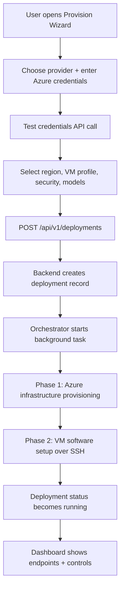
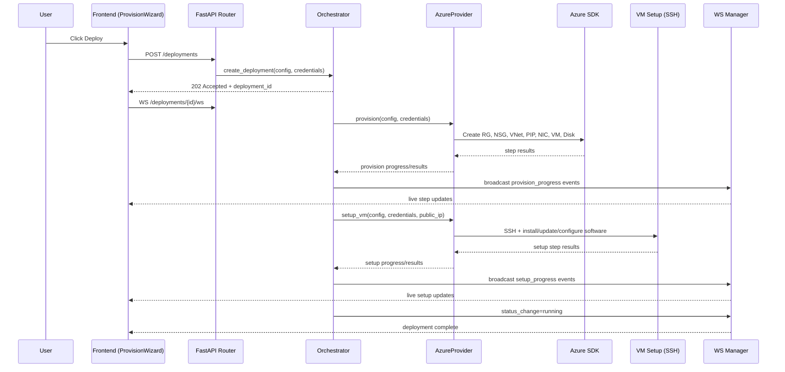
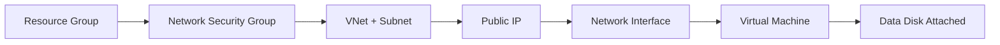
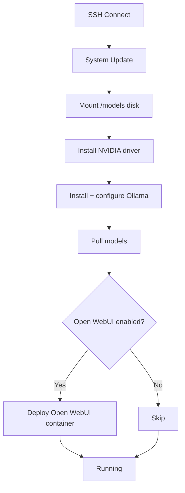

# PrivateAI Technical Explainer

This document explains how the current application is structured and how provisioning runs from click to cloud resources. It is written for developers who are new to the codebase and need a fast, accurate mental model.

## What This App Does

PrivateAI provisions and manages Azure VMs for AI workloads (Ollama + optional Open WebUI) through a full-stack interface:

- Frontend: Next.js (plus optional Electron shell)
- Backend: FastAPI with REST + WebSocket APIs
- Cloud: Azure SDK-based provisioning (no shelling out to Azure CLI)
- VM setup: SSH automation via Paramiko

At a high level, the app does two big jobs:

1. Create infrastructure in Azure (resource group, network, VM, disk)
2. Configure software on the VM (drivers, Ollama, models, Open WebUI)

---

## Current Architecture (New Structure)

```text
User (Browser/Electron)
        |
        v
Frontend (Next.js, app/*)
  - ProvisionWizard
  - Dashboard
  - Settings
  - TerminalPanel / WebUIPanel
        |
        | HTTP + WebSocket
        v
Backend (FastAPI, backend/app/*)
  - Routers (deployments/providers/services/terminal)
  - Orchestrator (async lifecycle control)
  - Provider Registry (azure or mock)
  - DeploymentStore (in-memory state)
  - WSManager (live progress broadcasts)
        |
        +--------------------+
        |                    |
        v                    v
AzureProvider          VM Setup + Validation
(Azure SDK)            (Paramiko SSH)
        |
        v
Azure Resources (RG, NSG, VNet, PIP, NIC, VM, Disk)
```

---

## Repository Map (Important Paths)

```text
backend/
  main.py
  app/
    routers/
      deployments.py
      providers.py
      services.py
      terminal.py
    services/
      orchestrator.py
      deployment_store.py
      ws_manager.py
    providers/
      registry.py
      base.py
      azure/
        provider.py
        config.py
        vm_setup.py
        validator.py
      mock/
        provider.py
    models/
      deployment.py
      credentials.py
      schemas.py

frontend/
  app/
    page.tsx
    dashboard/Dashboard.tsx
    provision/ProvisionWizard.tsx
    settings/Settings.tsx
    components/TerminalPanel.tsx
    components/WebUIPanel.tsx
    lib/api.ts
    lib/types.ts
    lib/storage.ts
  electron/
    main.ts
```

---

## End-to-End Provisioning Flow

### 1) User-driven flow



### 2) API and async execution flow



---

## Backend Execution Model

### Request lifecycle

1. `backend/app/routers/deployments.py` receives `POST /api/v1/deployments`
2. `DeploymentOrchestrator.create_deployment()` persists initial record
3. Orchestrator launches `_run_provision()` via `asyncio.create_task(...)`
4. Client receives immediate `202 Accepted` (non-blocking UX)
5. Frontend subscribes to WebSocket updates

This is why provisioning feels real-time without blocking HTTP requests.

### State and progress signaling

- Persistent runtime state: `DeploymentStore` (in-memory)
- Progress fan-out: `WSManager.broadcast(...)`
- Client view model: `ProvisionWizard` + `Dashboard` merge API state and WS events

---

## Azure Provisioning Internals

The Azure-specific logic is in `backend/app/providers/azure/provider.py` and `backend/app/providers/azure/config.py`.

### Infrastructure phase (Azure SDK)

The provider performs these steps in order:

1. Create Resource Group
2. Create Network Security Group (SSH/Ollama/Open WebUI rules)
3. Create VNet + Subnet
4. Create Static Public IP
5. Create NIC (accelerated networking when supported)
6. Create VM (standard or confidential security profile)
7. Attach data disk



### Software setup phase (SSH)

Implemented in `backend/app/providers/azure/vm_setup.py`:

1. Connect via SSH (with retries)
2. Update OS packages
3. Format + mount data disk at `/models`
4. Install NVIDIA driver
5. Install/configure Ollama (systemd, model path, host bind)
6. Pull selected Ollama models
7. Optional Open WebUI container deployment



---

## Deployment Status State Machine

The app tracks explicit lifecycle states (see `backend/app/models/deployment.py`).

```text
pending
  -> provisioning
  -> setting_up
  -> running

running
  -> stopping -> stopped
stopped
  -> starting -> running

any active state
  -> failed (on error)
  -> destroying -> destroyed
```

The frontend uses these states to control which actions appear (Start, Stop, Destroy, Open Terminal, Open WebUI).

---

## Live Updates and UI Behavior

### WebSocket event pattern

During provisioning, backend broadcasts events to `WS /api/v1/deployments/{id}/ws`:

- `provision_progress` for infra steps
- `setup_progress` for VM setup steps
- `status_change` on lifecycle transitions
- `provision_complete` when infrastructure is ready

This powers:

- Progress bars and step indicators in `ProvisionWizard`
- Real-time card updates in `Dashboard`
- Faster operator feedback when something fails mid-pipeline

---

## Modes: Real Cloud vs Mock

Provider registration is centralized in `backend/app/providers/registry.py`.

- `PRIVATEAI_TEST_MODE=true`: use `MockProvider` (no Azure calls)
- otherwise: use `AzureProvider`

This is core to safe local development: UI and API can be exercised end-to-end without cloud spend.

---

## Security and Credential Handling

- Azure auth uses service principal credentials (`tenant_id`, `client_id`, `client_secret`)
- Credentials are held in process memory for active deployment operations
- VM access uses SSH keys (password auth disabled)
- Optional Confidential VM mode enables secure boot, vTPM, and guest-state encryption
- NSG rules expose only required ports (22, 11434, optional WebUI)

For initial Azure setup and RBAC/service principal creation, see `azure_guide.md`.

---

## Cost and Lifecycle Controls

Cost-sensitive operations are part of the runtime flow:

- Stop VM: deallocate compute (`begin_deallocate`) to stop compute billing
- Start VM: power-on (`begin_start`) and refresh endpoints
- Destroy deployment: delete entire resource group
- Auto-shutdown: Azure schedule resource (`Microsoft.DevTestLab/schedules`)

Operationally, the best cost practice is to stop or destroy idle GPU VMs quickly.

---

## How a New Developer Should Trace Execution

If you are onboarding, read files in this order:

1. `frontend/app/provision/ProvisionWizard.tsx` (how deploy is initiated)
2. `frontend/app/lib/api.ts` (API contracts used by UI)
3. `backend/app/routers/deployments.py` (HTTP/WS entry points)
4. `backend/app/services/orchestrator.py` (core flow controller)
5. `backend/app/providers/azure/provider.py` (Azure infra lifecycle)
6. `backend/app/providers/azure/vm_setup.py` (post-provision VM setup)
7. `backend/app/providers/azure/validator.py` (health verification)

This path gives you the exact call chain from button click to running AI endpoint.

---

## Quick Troubleshooting Map

```text
Deploy request accepted but no progress?
  -> Check WS connection and deployment_id routing

Infra step fails early?
  -> Check Azure credentials, subscription permissions, region quota

VM created but setup fails?
  -> Check NSG SSH access, VM boot readiness, SSH key availability

Running but model/API unavailable?
  -> Check Ollama service, model pull logs, port rules (11434/WebUI)
```

---

## Related Docs

- `README.md`: project setup and high-level architecture
- `API_Spec.md`: endpoint contracts and payload examples
- `azure_guide.md`: Azure account + service principal provisioning guide
- `backend/testing_procedure.md`: phased testing strategy

This technical explainer is intentionally architecture-first so a new contributor can quickly reason about where logic lives and how provisioning executes across frontend, backend, and Azure.
